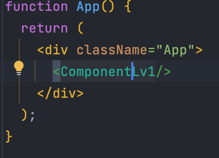
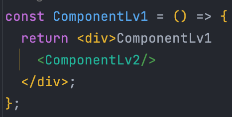
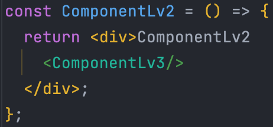

# 2. ใช้ข้อมูลจากการ Query ในข้อที่ 1 มาใช้ในการส่งผ่านข้อมูลจาก Server ไป Client ด้วย REST API พร้อมแสดงผลในรูปแบบของ Component ต่างๆ
การส่งข้อผมูลผ่าน Component ไม่จำกัดวิธีการในการทำ 
## 2.1 กำหนดให้  ComponentLv1 อยู่ภายใต้ App

## 2.2 กำหนดให้  ComponentLv2 อยู่ภายใต้ ComponentLv1 และส่งข้อมูลจาก App ไปยัง ComponentLv2 โดยผ่าน ComponentLv1

### 2.2.1 แสดงข้อมูลที่ได้จากการ query ของ collections navigation พร้อมจัดรูปแบบการแสดงผลให้สวยงามและเข้าใจได้ง่าย

## 2.3 กำหนดให้  ComponentLv3 อยู่ภายใต้ ComponentLv2 และส่งข้อมูลจาก App ไปยัง ComponentLv3 โดยผ่าน  ComponentLv1 และ ComponentLv2

### 2.3.1 แสดงข้อมูลที่ได้จากการ query ของ collections web_categories พร้อมจัดรูปแบบการแสดงผลให้สวยงามและเข้าใจได้ง่าย
